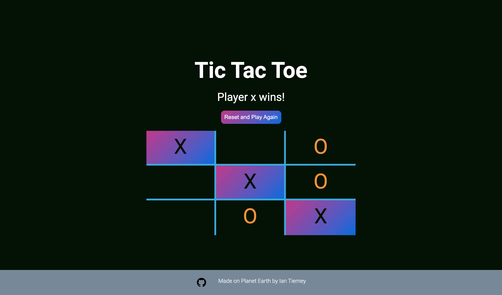
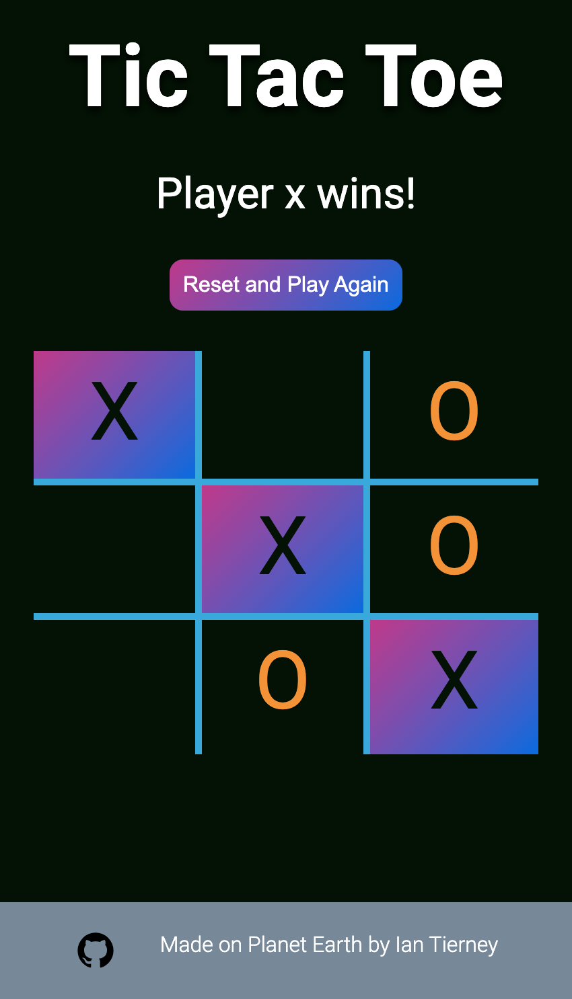

## Tic Tac Toe
This project goal was to create a Tic Tac Toe game with code organized inside factory functions and object oriented programming. 

The user is player X and once they select a space for their move, the computer makes a move too. If the player X gets 3 in a row, they win and the game is over. If the computer gets 3 in a row, the player X loses and the game is over. If all spaces are taken and there is no 3 in a row, the game is a tie. 

The project was built using HTML, CSS, and Javascript

### Desktop view

### Mobile view
